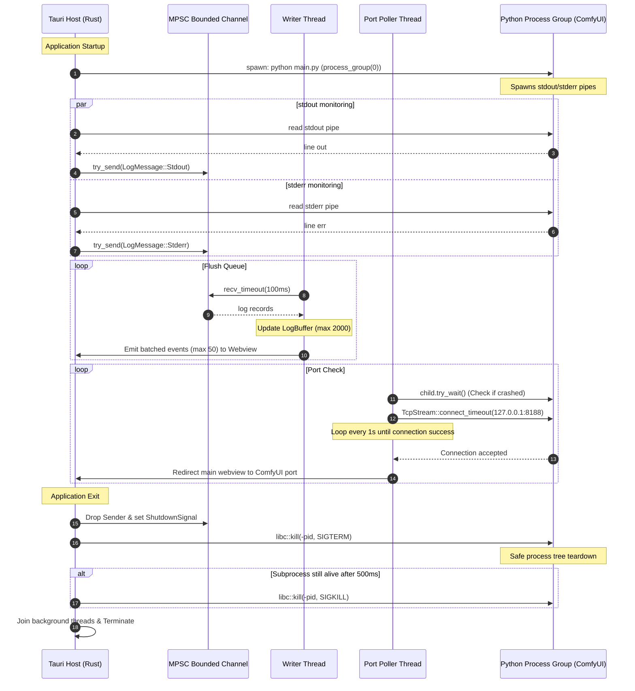

# ComfyUi-arwaky

A customized, high-performance desktop application shell for [ComfyUI](https://github.com/Comfy-Org/ComfyUI) built using **Tauri v2** and **Rust**. This **ComfyUi-arwaky** build (developed by `rakaarwaky`) is specifically tailored to provide a seamless, optimized desktop experience on Linux with out-of-the-box support for AMD ROCm GPU acceleration. 

Unlike generic wrappers, **ComfyUi-arwaky** integrates automated AMD microarchitecture detection, environment tuning, process group lifecycle management, and a bounded logging pipeline designed to eliminate standard desktop setup hassles for Radeon GPU users.

[](https://github.com/rakaarwaky/ComfyUi-arwaky/actions/workflows/ci.yml)
[](https://opensource.org/licenses/MIT)
[](https://v2.tauri.app/)
[](https://rocm.docs.amd.com/)

---

## 🚀 Why ComfyUI Desktop? (vs. Raw ComfyUI)

Running ComfyUI from a terminal and opening it in a browser can be messy. ComfyUI Desktop packages the engine into a clean, native desktop application that does the heavy lifting for you:

* **Zero CLI Hassle**: Double-click to launch. The app handles spawning the backend virtual environment, verifying files, and tracking startup in a clean interface.
* **Smart GPU Tuning for AMD ROCm**: If you use an AMD card (such as RX 6700 XT or RX 7600), you no longer need to write scripts exporting `HSA_OVERRIDE_GFX_VERSION` or `HIP_VISIBLE_DEVICES`. The app auto-detects your microarchitecture and applies the correct overrides.
* **No More Zombie Processes**: Standard ComfyUI terminals often leave background Python threads running when closed, blocking port `8188`. ComfyUI Desktop binds the backend to a process group and guarantees a clean shutdown on exit.
* **Integrated Diagnostics**: Real-time console logs are piped directly into the app launcher window. If something goes wrong, you can inspect it instantly or click "Copy Logs" to get a clean troubleshoot file.

---

## ⚖️ Is This App Right For You?

Let's be realistic—this wrapper isn't for everyone. Here is how to decide if you should use this repository or look elsewhere:

### ✅ You SHOULD use this if:
* You run **Linux** (e.g. Fedora, Ubuntu) and want a native app container.
* You own an **AMD Radeon GPU** (RX 6000 or RX 7000 series) and want auto-configured ROCm integration.
* You are tired of terminal clutter, background zombie processes, and manually managing ports.
* You want a dedicated window with hardware acceleration enabled via WebKitGTK.

### ❌ You should NOT use this if:
* **You are on Windows or macOS**: This shell is heavily optimized and compiled for Linux-based ROCm workflows.
* **You use an NVIDIA GPU**: NVIDIA's CUDA drivers are natively supported by the standard ComfyUI installer; you will get a simpler, more direct setup using the official ComfyUI Windows/standalone packages.
* **You run ComfyUI on a headless server or Docker**: This is a desktop client shell. If you run your generation on a remote server or in the cloud, you only need the raw Python backend or a Docker container.
* **You prefer browser tab management**: If you like having ComfyUI in your standard browser (Firefox, Chrome) alongside other tabs or extensions, running the raw backend is a better fit.

---

## 📖 Table of Contents
- [Why ComfyUI Desktop?](#-why-comfyui-desktop-vs-raw-comfyui)
- [Is This App Right For You?](#-is-this-app-right-for-you)
- [Features](#features)
- [System Requirements](#system-requirements)
- [Quick Start & Installation](#quick-start--installation)
  - [AppImage (Portable)](#appimage-portable)
  - [RPM Package (Fedora)](#rpm-package-fedora)
  - [Building From Source](#building-from-source)
- [Architecture & Runtime Flow](#architecture--runtime-flow)
- [Configuration](#configuration)
  - [GPU Selection Overrides](#gpu-selection-overrides)
  - [Environment Variables](#environment-variables)
  - [External Model Paths](#external-model-paths)
- [Detailed Guides](#detailed-guides)
- [License](#license)

---

## Features

* **Smart GPU Auto-Detection** – Scans `rocm-smi` to identify and automatically select the discrete GPU with the largest VRAM.
* **Automatic HSA Override Setup** – Detects unsupported/patched AMD GPU microarchitectures (including RDNA 2, RDNA 3, and future-proof RDNA 4 cards like RX 6700, RX 7600, or GFX12 variants) and automatically applies matching version patches (`HSA_OVERRIDE_GFX_VERSION`).
* **Robust Process Group Lifecycle** – Spawns ComfyUI in a process group (`process_group(0)`) and sends process-group `SIGTERM`/`SIGKILL` signals on exit, preventing residual python zombie processes.
* **Bounded & Batched Log Routing** – Collects stdout/stderr via multi-threaded readers, pipes them through a bounded MPSC channel, stores them in a 2,000-entry memory log, and batches them (50 messages / 100ms) to the UI.
* **Liveness Port Polling** – Continually polls the ComfyUI TCP port (`127.0.0.1:8188`) and redirects the Tauri webview immediately once it responds.
* **Multi-Distro Packaging** – Generates portable AppImages, Fedora RPMs, and Debian/Ubuntu DEB packages.
* **Rootless Local Installation** – Includes helper scripts to extract and relocate the application to local user space directories (`~/.local`) without requiring administrative permissions.

---

## System Requirements

| Component | Minimum / Recommended |
|---|---|
| **Operating System** | Linux (Fedora 40+, Ubuntu 24.04+, Debian 12+, or compatible distributions) |
| **AMD GPU** | Radeon RX 6000, RX 7000, or RX 8000 Series (RDNA 2, RDNA 3, or RDNA 4 microarchitectures) |
| **AMD ROCm** | version `7.2.4` or higher installed on host |
| **Python Runtime** | version `3.12` |

---

## Quick Start & Installation

### AppImage (Portable)

No installation required. Download the latest AppImage and execute:

```bash
chmod +x ComfyUI-Desktop-*.AppImage
./ComfyUI-Desktop-*.AppImage
```

### RPM Package (Fedora)

Install the compiled package system-wide:

```bash
sudo rpm -i comfyui-desktop-*.rpm
comfyui-desktop
```

*Note: If you do not have root privileges, you can extract the package contents to user space using the local installer script:*
```bash
bash scripts/install_local.sh
```

### Building From Source

1. **Clone the repository recursively** to download the ComfyUI submodule:
   ```bash
   git clone --recurse-submodules https://github.com/rakaarwaky/ComfyUi-arwaky.git
   cd ComfyUi-arwaky
   ```

2. **Configure the Python Virtual Environment** and install ROCm-compatible dependencies:
   ```bash
   python3.12 -m venv venv
   source venv/bin/activate
   pip install -r requirements.txt
   ```

3. **Run the Tauri Application in Developer Mode**:
   ```bash
   npx @tauri-apps/cli dev
   ```

4. **Compile the Production Bundles**:
   ```bash
   bash scripts/build.sh
   ```

---

## Architecture & Runtime Flow

The following sequence diagram outlines the process lifecycle, asynchronous thread communication, log pipelines, and cleanup procedures when running ComfyUI Desktop:



For a detailed technical breakdown, refer to the [Architecture Guide](file:///home/raka/App/ComfyUi-arwaky/docs/architecture.md).

---

## Configuration

### GPU Selection Overrides

By default, the application runs smart detection scripts using `rocm-smi` to choose the discrete GPU index with the most VRAM. If you want to force a specific GPU card manually, supply the standard environment variable prefix:

```bash
HIP_VISIBLE_DEVICES=1 ./ComfyUI-Desktop-*.AppImage
```

### Environment Variables

| Variable | Default Value | Description |
|---|---|---|
| `HIP_VISIBLE_DEVICES` | Auto-detected | Overrides which GPU device index is visible to PyTorch. |
| `HSA_OVERRIDE_GFX_VERSION` | Auto-detected | Emulated hardware instruction target version (e.g. `10.3.0` or `11.0.0`) for non-natively supported ROCm GPUs. |
| `WEBKIT_DISABLE_DMABUF_RENDERER` | `1` | Disables DMA-BUF renderer to prevent blank/black screens on AMD setups under WebKitGTK. |
| `WEBKIT_FORCE_COMPOSITING_MODE` | `1` | Forces GPU hardware acceleration for the Tauri webview renderer. |
| `GIO_USE_PROXY_RESOLVER` | `dummy` | Bypasses local network proxy detection to speed up launch times. |

### External Model Paths

You can configure ComfyUI to read custom model checkpoints from existing local directories rather than copying them inside the app. Modify the `extra_model_paths.yaml` file in the root directory:

```yaml
comfyui:
  base_path: /path/to/your/custom/stable-diffusion-assets/
  checkpoints: checkpoints/
  vae: vae/
  loras: loras/
  controlnet: controlnet/
```

---

## Detailed Guides

Explore the following deep-dive guides for more configuration, maintenance, and architecture topics:

* 🧩 [Architecture Design & Pipeline](file:///home/raka/App/ComfyUi-arwaky/docs/architecture.md) – In-depth overview of logging, IPC batching, port listening, and safe shutdown commands.
* 🚀 [AMD ROCm & GPU Setup Guide](file:///home/raka/App/ComfyUi-arwaky/docs/gpu_guide.md) – Step-by-step procedures for installing ROCm, checking hardware compliance, and understanding GPU detection.
* 🛠️ [Script Utilities Reference](file:///home/raka/App/ComfyUi-arwaky/docs/scripts.md) – Detailed guide on version bumping, local packaging, dependency upgrading, and the local validation harness.
* 🩺 [Troubleshooting Handbook](file:///home/raka/App/ComfyUi-arwaky/docs/troubleshooting.md) – Solutions for blank rendering panels, PyTorch ROCm initialization issues, zombie processes, and memory management.
* 👥 [Contributing Guidelines](file:///home/raka/App/ComfyUi-arwaky/CONTRIBUTING.md) – Detailed instructions for setting up the dev environment, coding standards, and local tests.

---

## License

This project is licensed under the [MIT License](LICENSE).
